# Morra

My name is Teh Jing Ling. I am joining the Reach Malaysia Hackathon 2022. The Morra Project is a pre-requisite for joining the hackathon competition.

Please press this link to run the app:
http://morra-pied.vercel.app/

How to play?

1. Choose a role
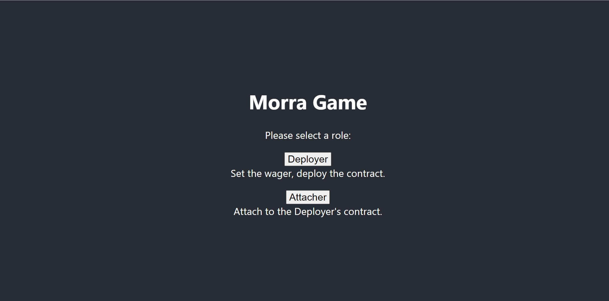</img>

2. Deployer set wager
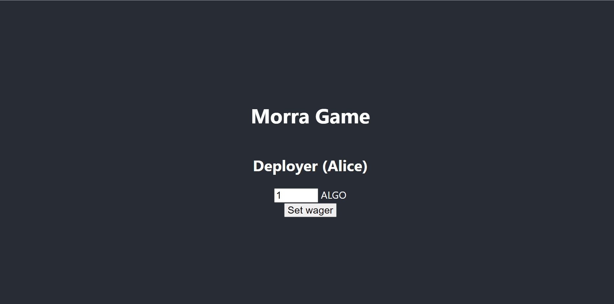</img>

3. Deployer deploy
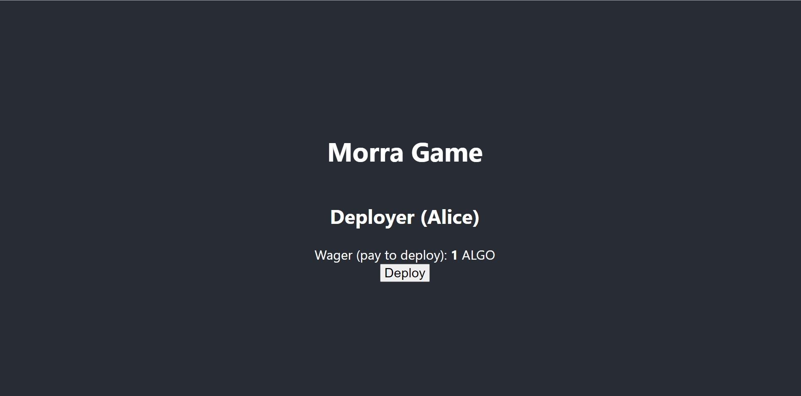</img>

4. Deployer copy contract info to Attacher
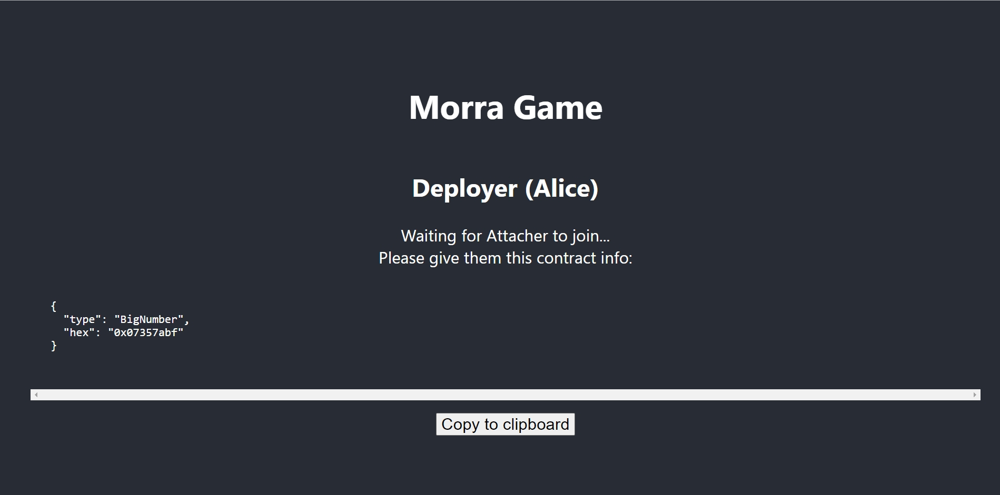</img>

5. Attacher pass contract info to Deployer and attach
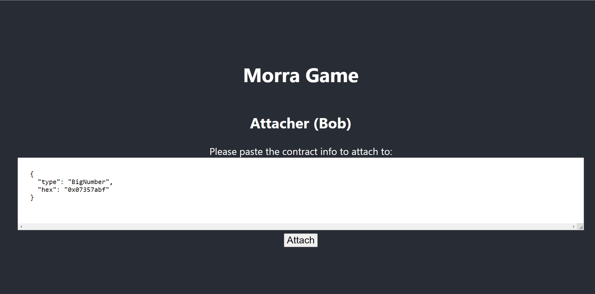</img>

6. Attacher accept terms and pay wager
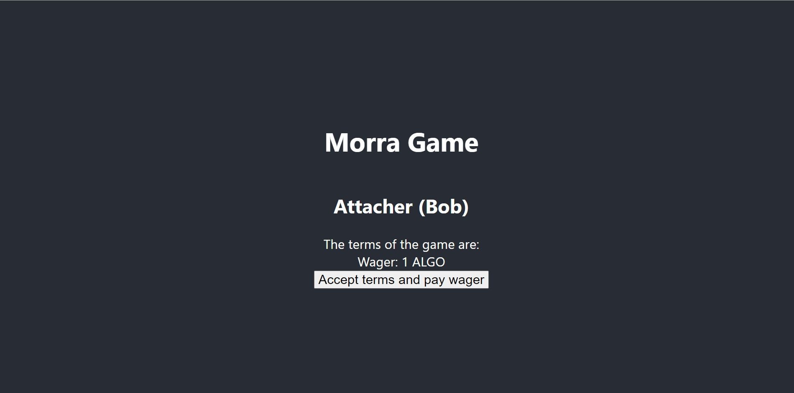</img>

7. Deployer choose one number
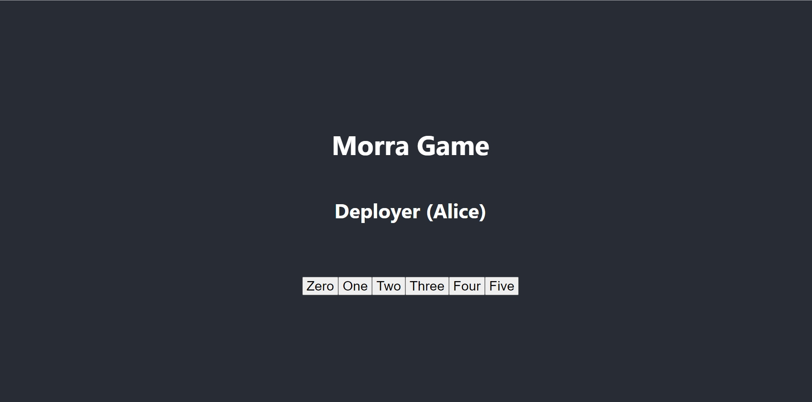</img>

8. Deployer choose total number
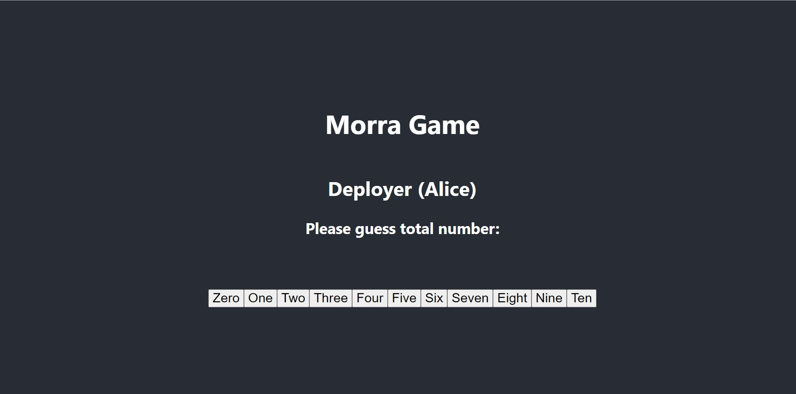</img>

9. Attacher choose one number
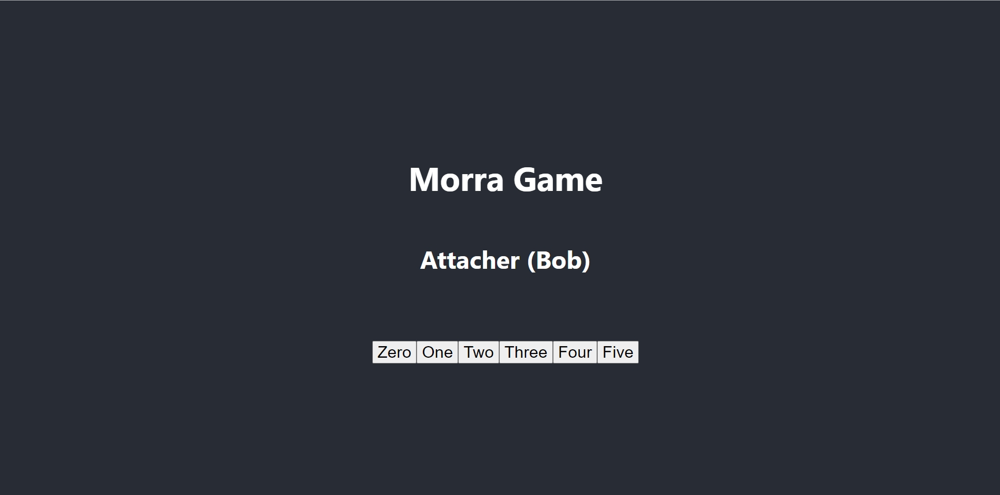</img>

10. Attacher choose total number
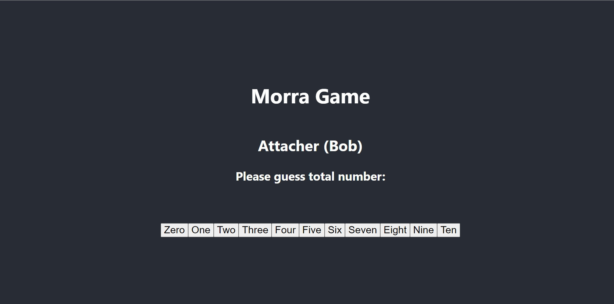</img>

11. Deployer view the winner
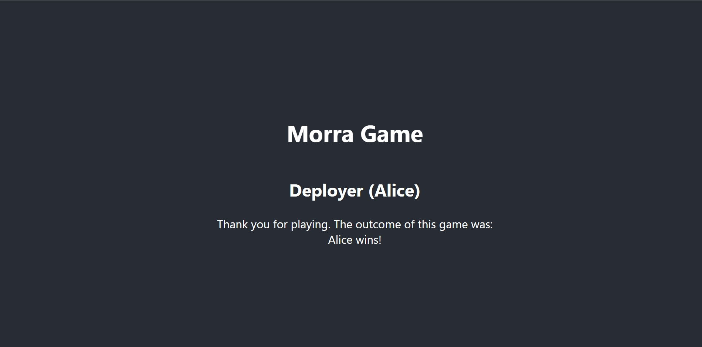</img>

12. Attacher view the winner
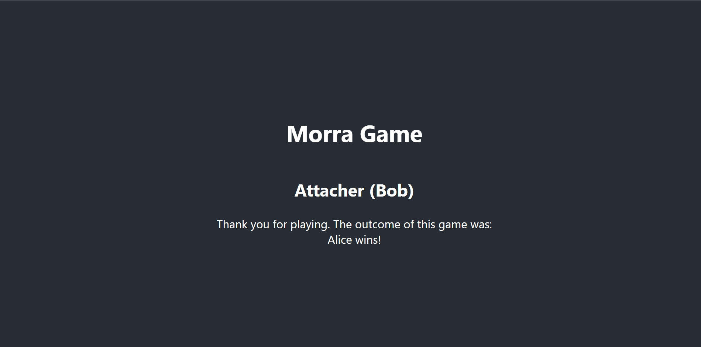</img>

